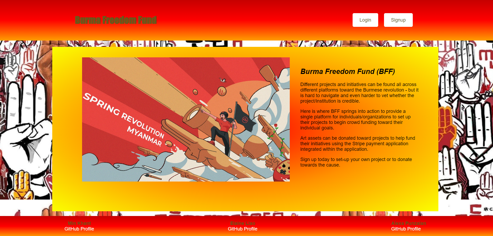
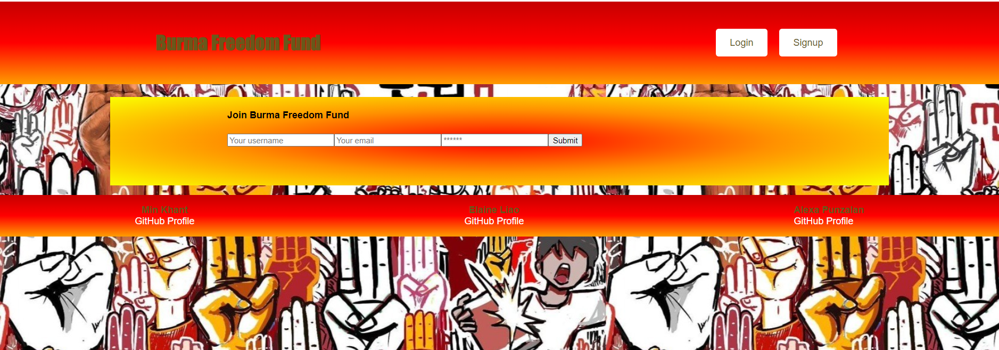
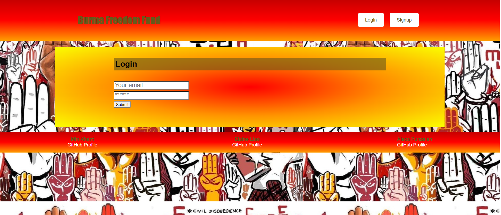
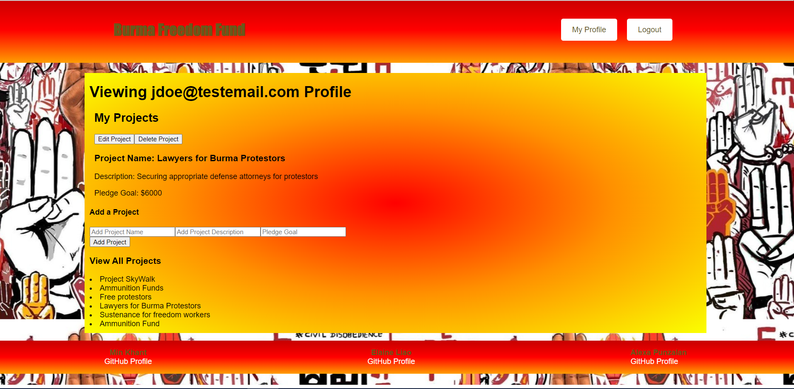

# Burma Freedom Fund (Crowd-funding Application)

-----

## Table of Contents
1. [Description](#description)
2. [Installation](#installation)
3. [Usage](#usage)
4. [Contributing](#contributing)
6. [License](#license)
7. [Questions](#questions)

-----

### Description 
 A special concept crowd-funding application that will allow those fighting for the Burmese Revolution to organize funding efforts on a secure platform.  Project organizers will be able to allow users to donate art assets toward their individual causes. Users can also sign up to purchase art in support of the revolution.

TECHNOLOGIES USED: MongoDB and Mongoose ODM for the database,  React front end, pure CSS for styling, Apollo/GraphQL API with Node.js and Express.js server, User Authentication (JWT) 

Project Deployed to Google Cloud: https://robotic-sanctum-364800.uw.r.appspot.com/ 

GitHub repo: https://github.com/min-hinthar/project-3-crowdfunding-app 

 Application Main Landing Page

Sign-Up Page

Log-In Page

Logged-in View (Test Profile: JDoe@testemail.com)

-----

### Installation 
<<<<<<< HEAD
Run 'npm i' to install all required dependicies for the application. 
=======
Run 'npm i' to install all required dependencies for the application. 
>>>>>>> develop

-----

### Usage 

To run the application, run 'npm run seeds' to populate seeded data, to launch run 'npm run develop' to run both the client and server scripts. Otherwise, visit the deployed project linked above to test the applications functionality.

<b>User Story</b> 

As a proponent of the Burmese Revolution, I would like to sign up for an account to raise funds for my cause/project.  Users who would like to support the different causes can sign up for an account to purchase art or simply donate directly.

<b>Acceptance Criteria</b> 
<ul>
<li>Use React for the front end.</li>

<li>Use GraphQL with a Node.js and Express.js server.</li>

<li>Use MongoDB and the Mongoose ODM for the database.</li>

<li>Use queries and mutations for retrieving, adding, updating, and deleting data.</li>

<li>Be deployed using Heroku (with data).</li>

<li>Have a polished UI.</li>

<li>Be responsive.</li>

<li>Be interactive (i.e., accept and respond to user input).</li>

<li>Include authentication (JWT).</li>

<li>Protect sensitive API key information on the server.</li>

<li>Have a clean repository that meets quality coding standards (file structure, naming conventions, best practices for class and id naming conventions, indentation, high-quality comments, and so on).</li>

<li>Have a high-quality README (with unique name, description, technologies used, screenshot, and link to deployed application).</li>
</ul>

-----

### Contributing 
YES 

-----

### License 
MIT 

-----

### Questions 

#### GitHub Usernames: AlexaP2022, Ehliao, Min-hinthar 

#### GitHub URL: https://github.com/min-hinthar

#### GitHub Repo: https://github.com/min-hinthar/project-3-crowdfunding-app/

#### Email: alexapunzalan@gmail.com, ehliao815@gmail.com, min@hintharinc.com

-----
